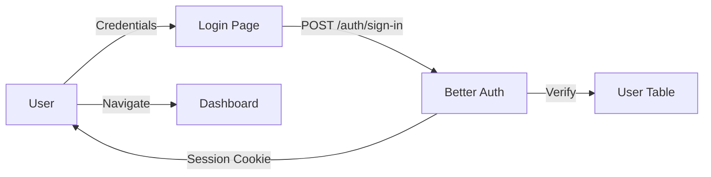
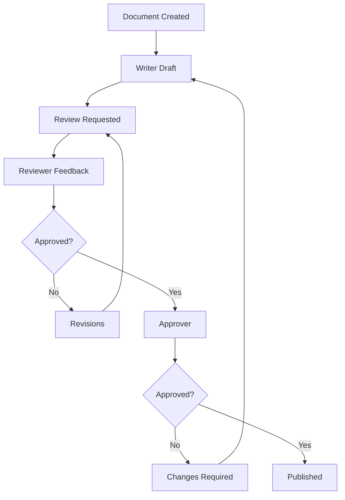

# DocFusion

A comprehensive, AI-powered document management and collaboration platform designed for modern businesses. DocFusion combines document creation, template management, team collaboration, AI assistance, and professional publishing into a seamless workflow.

## Table of Contents

- [Features](#features)
- [HDSI Editor](#hdsi-editor)
- [Publishing & Export](#publishing--export)
- [Architecture](#architecture)
- [Authentication](#authentication)
- [Documents](#documents)
- [Opportunities](#opportunities)
- [Templates](#templates)
- [AI Features](#ai-features)
- [Diagrams](#diagrams)
- [Company Setup](#company-setup)
- [Development](#development)
- [Deployment](#deployment)

---

## Features

### Core Capabilities

| Feature | Description | Status |
|---------|-------------|--------|
| **Rich Text Editing** | Full-featured Tiptap editor with formatting, tables, images, equations | ✅ |
| **AI Content Generation** | Generate sections, rewrite, expand, condense via AI | ✅ |
| **Document Outline** | Hierarchical structure, navigation, drag-drop reordering | ✅ |
| **Comments & Review** | Threaded comments, review/approval workflow, deadlines | ✅ |
| **Templates** | 65+ production templates across 7 categories | ✅ |
| **Snippets** | Reusable content blocks with shortcut expansion | ✅ |
| **Search/Replace** | Regex support, case sensitivity, replace all | ✅ |
| **Diagrams** | Mermaid, PlantUML, Structurizr (C4), D2 formats | ✅ |
| **Real-time Collab** | Collaborative cursors, presence awareness | ✅ |
| **Version History** | Document versioning with diff and restore | ✅ |
| **Bibliography** | Full citation management with BibTeX support | ✅ |
| **Index Generation** | Auto-generate document index | ✅ |
| **Equations** | LaTeX-style math typesetting | ✅ |
| **File Attachments** | Link external files and images | ✅ |
| **Export** | Markdown, PDF, DOCX, HTML, LaTeX, JSON | ✅ |

---

## HDSI Editor

### Hierarchical Document Synthesis Interface

The HDSI Editor is a comprehensive document editing environment with 50+ advanced features:

#### Document Structure Management

- **Drag-and-Drop Reordering**: Move sections visually
- **Nested Hierarchy**: Create chapters → sections → subsections → paragraphs
- **Indent/Outdent**: Promote or demote sections in hierarchy
- **Move Up/Down**: Reorder within same level
- **Expand/Collapse**: Tree view navigation
- **Visual Status**: Outline, generating, generated, error states

#### Rich Text Editing

**Formatting:**
- Bold, italic, underline, strikethrough
- Text colors (Black, Red, Green, Blue, Purple)
- Text highlighting (Yellow, Green, Blue)
- Subscript/Superscript (for citations and footnotes)

**Structure:**
- Headings (H1-H6)
- Ordered/unordered lists
- Task lists with checkboxes
- Tables with headers and resizable columns
- Blockquotes
- Code blocks

**Media:**
- Images (with base64 support)
- Diagrams (5 formats)
- File attachments
- External links

#### Equations

**Math Typesetting:**
- Block equations: `$$E = mc^2$$`
- Inline math: `$x^2$`
- LaTeX syntax support
- Toolbar buttons for quick insertion

**Usage:**
```
Type $$equation$$ for block equations
Type $equation$ for inline math
Or use the "Equation" button in toolbar
```

#### Publishing Features

**Bibliography & Citations:**
- 6 citation styles (APA, MLA, Chicago, IEEE, Vancouver, Harvard)
- 14 entry types (article, book, inproceedings, etc.)
- BibTeX import/export
- Citation insertion
- Formatted bibliography preview

**Footnotes & Sidebars:**
- Automatic footnote numbering
- Sidebar/callout boxes
- Margin notes

**Watermarks & Layout:**
- Configurable watermarks (text, opacity, angle)
- Page numbers
- Page layout settings (margins, orientation)

**Tables of Content:**
- Auto-generated TOC with page numbers
- List of diagrams
- List of tables
- List of figures

#### AI Integration

**Per-Section Generation:**
```typescript
// Generate content for any section
const content = await generateSectionContent(node, documentTitle, {
  temperature: 0.7,
  maxTokens: 2000,
  stream: true,
  onProgress: (chunk) => console.log(chunk)
});
```

**Outline Generation:**
- AI generates document structure from description
- Choose from 65+ templates
- Start from blank

**Features:**
- Token budget control per section
- Custom prompts for fine-tuning
- Density target (information density)
- Generation status tracking

#### Collaboration

**Real-time:**
- Multi-user cursors
- Presence awareness (who's editing)
- Eye tracking indicator (optional)
- Voice input (optional)

**Views:**
- Tree view (hierarchical)
- Graph view (force-directed network)
- Backlinks panel (bidirectional links)

---

## Publishing & Export

### Export Formats

| Format | Extension | Features |
|--------|-----------|----------|
| **Markdown** | `.md` | TOC, index, diagrams, links |
| **HTML** | `.html` | Styled, printable, watermarks |
| **PDF** | `.pdf` | Browser print-to-PDF |
| **DOCX** | `.docx` | Microsoft Word compatible |
| **LaTeX** | `.tex` | Academic typesetting |
| **JSON** | `.json` | Data preservation |
| **Plain Text** | `.txt` | Simple text export |

### Markdown Export

```typescript
import { exportToMarkdown } from "@/lib/hdsi/export";

const markdown = exportToMarkdown(nodes, documentTitle, {
  includeTOC: true,        // Table of contents
  includeIndex: true,      // Auto-generated index
  includeDiagrams: true,   // List of diagrams
  indexOptions: {
    includeAutoTerms: true,
    minTermLength: 4
  }
});
```

**Output includes:**
- Document title
- Table of contents with anchors
- List of diagrams
- All content with proper heading levels
- Auto-generated index (alphabetical)

### Bibliography Compilation

**Location:** `frontend/components/document/BibliographyManager.tsx`

**Features:**
- Import from BibTeX
- Add/edit/delete entries
- Search and filter
- Sort by cite key, year, citations, title
- Statistics dashboard

**Citation Styles:**
- APA 7th Edition
- MLA 9th Edition
- Chicago 17th Edition
- IEEE
- Vancouver
- Harvard

**Usage:**
```typescript
<BibliographyManager
  entries={bibliographyEntries}
  currentStyle="apa"
  onCiteEntry={(entryId) => insertCitation(entryId)}
  onEntriesChange={(entries) => saveEntries(entries)}
/>
```

### Index Generation

**Location:** `frontend/lib/hdsi/auto-index.ts`

**Auto-Extract Terms:**
```typescript
import { generateAutoIndex, formatIndex } from "@/lib/hdsi/auto-index";

const index = generateAutoIndex(nodes, markedEntries, {
  includeAutoTerms: true,     // Extract from content
  minTermLength: 4,           // Ignore short words
  excludeTerms: ["common", "words"],
  caseSensitive: false
});

// Export to any format
const text = formatIndex(index, "text");
const html = formatIndex(index, "html");
const markdown = formatIndex(index, "markdown");
```

**Extracted Terms:**
- Capitalized phrases (proper nouns)
- Quoted terms
- Acronyms (2-5 uppercase letters)
- Technical terms with numbers

**Output:**
- Alphabetical categorization (A-Z)
- Section locations
- Cross-references (See, See also)

### Table of Diagrams

**Auto-Detection:**
```typescript
import { generateTableOfDiagrams } from "@/lib/hdsi/auto-index";

const diagrams = generateTableOfDiagrams(nodes, "markdown");
```

**Detects:**
- `node.diagramData` metadata
- `[Diagram: Name]` or `[Figure: Name]` in content
- Markdown images ``

**Output:**
- Numbered list
- Diagram titles
- Types (Mermaid, PlantUML, etc.)
- Locations in document

### File Attachments

**Location:** `frontend/lib/editor/extensions/external-file.ts`

**Usage:**
1. **Drag & Drop:** Drag file onto editor
2. **Attach Button:** Click "Attach File", select file

**Features:**
- File type icons (PDF, Image, Video, Code, etc.)
- File size display (B, KB, MB, GB)
- Description support
- Click to download/open

**Programmatic:**
```typescript
editor.chain().focus().insertExternalFile({
  url: "https://example.com/file.pdf",
  filename: "document.pdf",
  fileType: "application/pdf",
  fileSize: 1024000,
  description: "Supporting documentation"
}).run();
```

### LaTeX Export

```typescript
import { exportToLaTeX } from "@/lib/hdsi/export";

const latex = exportToLaTeX(nodes, title, {
  author: "Document Author",
  date: "2024-01-30",
  includeBibliography: true,
  bibliographyEntries: entries,
  citationStyle: "apa"
});
```

**Features:**
- Full document structure
- Bibliography with `thebibliography`
- Hyperlinks
- Page geometry
- One-and-a-half line spacing

---

## Architecture

### Tech Stack

```
Frontend:      Next.js 15 + React 19 + TypeScript 5
Backend:       Next.js API Routes + Server Actions
Database:      PostgreSQL + Drizzle ORM
Auth:          Better Auth (session-based)
Realtime:      Yjs + WebSocket (collaborative editing)
AI:            Azure OpenAI / Ollama
Styling:       Tailwind CSS + shadcn/ui
PWA:           next-pwa
Diagrams:      Kroki (Mermaid, PlantUML, Structurizr, D2)
Math:          KaTeX (equation rendering)
```

### Key Libraries

| Library | Purpose |
|---------|---------|
| `@tiptap/*` | Rich text editing |
| `yjs` | CRDT for real-time collaboration |
| `better-auth` | Authentication framework |
| `drizzle-orm` | Database ORM |
| `framer-motion` | UI animations |
| `kroki` | Diagram rendering |
| `katex` | Math equation rendering |
| `@tiptap/extension-color` | Text color |
| `@tiptap/extension-subscript` | Subscript/superscript |

### Database Schema

See `/frontend/lib/db/schema.ts` for complete schema.

---

## Authentication

DocFusion uses **Better Auth** with organization-based authentication. All users are members of the **Datacraft** organization.

### User Roles

- **Admin**: Full system access
- **Manager**: Manage team, documents
- **Member**: Create/edit documents
- **Viewer**: Read-only access

### Authentication Flow



---

## Documents

### Document Editor

The document editor provides:

- **Rich Text Formatting**: Bold, italic, headings, lists, tables, colors
- **AI Assistance**: Generate, rewrite, expand, condense sections
- **Outline View**: Navigate document structure (H1-H6)
- **Drag-and-Drop**: Reorder sections visually
- **Comments**: Threaded comments on any section
- **Review Workflow**: Writer → Reviewer → Approver stages
- **Diagrams**: Insert Mermaid/PlantUML/D2/Structurizr diagrams
- **Equations**: LaTeX-style math typesetting
- **File Attachments**: Link external files
- **Snippets**: Expand shortcuts (/header → company header)
- **Search/Replace**: Regex support with navigation
- **Bibliography**: Full citation management
- **Index**: Auto-generated document index

### Document Structure

Each document has:
- `title`: Document name
- `content`: Tiptap JSON content
- `status`: draft, in_review, approved, archived
- `version`: Current version number
- `collaborators`: Team members
- `templateId`: Source template (if created from template)
- `metadata`: Extended fields

### Comments & Review



**Features:**
- Threaded comments
- Section-specific comments
- Emoji reactions
- Due dates for reviews
- Email notifications (placeholder)

---

## Opportunities

### RFP/Proposal Management

Track and manage proposal opportunities:

- **Full CRUD**: Create, read, update, delete opportunities
- **Filters**: Search, categories, dates, budget, priority
- **Votes**: Go/No-Go voting system with consensus
- **Status Tracking**: Pending, accepted, rejected, on-hold
- **Bulk Actions**: Update multiple at once
- **Import**: Import from CSV/Excel

### Opportunity Fields

- Title, description, organization
- Budget/value
- Submission deadline
- Status, priority, score
- Categories, sectors, countries
- Assigned team member
- Notes and custom fields

---

## Templates

### Template Categories (65+ Templates)

1. **Government RFPs** (8 templates)
   - Federal RFP Response
   - State RFP Response
   - Federal Grant Proposal (SF-424)
   - SBIR/STTR Proposal
   - IDIQ/Task Order Response
   - GSA Schedule Proposal
   - 8(a) Program Proposal
   - Joint Venture Proposal

2. **Business Proposals** (8 templates)
   - Enterprise Sales Proposal
   - Strategic Partnership Proposal
   - Consulting Proposal
   - Investment Memo
   - Vendor Evaluation
   - M&A Transaction
   - Project Charter
   - Change Management Plan

3. **Technical Documents** (8 templates)
   - Software Architecture Document
   - API Documentation
   - Statement of Work (SOW)
   - System Requirements Specification
   - User Manual
   - Operations Runbook
   - Test Plan
   - Data Privacy Impact Assessment

4. **Legal & Contracts** (6 templates)
   - Non-Disclosure Agreement (NDA)
   - Master Services Agreement (MSA)
   - Employment Agreement
   - Data Processing Agreement
   - Vendor Agreement
   - SaaS Subscription Agreement

5. **Marketing & PR** (5 templates)
   - Press Release
   - White Paper
   - Case Study
   - Product Launch Plan
   - Brand Guidelines

6. **HR & Internal** (5 templates)
   - Employee Handbook
   - Performance Review Form
   - Job Description
   - Incident Report
   - Internal Memo

7. **Business Planning & Management** (25 templates)
   - Strategic Business Plan
   - Startup Business Model Canvas
   - SWOT Analysis
   - Business Case Analysis
   - Financial Projections & Forecast
   - Budget Planning Template
   - Risk Assessment Matrix
   - Market Analysis Report
   - Competitive Analysis
   - Go-to-Market Strategy
   - Product Roadmap
   - Investment Pitch Deck
   - Executive Summary
   - Board Meeting Agenda
   - Stakeholder Communication Plan
   - Change Management Plan
   - Operations Manual
   - KPI Dashboard
   - Annual Business Review
   - Quarterly Business Review (QBR)
   - Resource Allocation Plan
   - Business Continuity Plan
   - Disaster Recovery Plan
   - Compliance Audit Checklist

### Template Features

- **Placeholders**: {{company_name}}, {{project_name}}, etc.
- **AI Instructions**: Generation prompts per section
- **Compliance**: FAR, DFARS, GDPR, ISO requirements
- **Length Controls**: Brief, medium, comprehensive
- **Difficulty**: Beginner, intermediate, advanced

---

## AI Features

### AI Configuration

Support for **Azure OpenAI** and **Ollama**:

```env
# Azure OpenAI
AZURE_OPENAI_API_KEY=your-key
AZURE_OPENAI_ENDPOINT=https://your-resource.openai.azure.com/
AZURE_OPENAI_DEPLOYMENT_NAME=gpt-4
AZURE_OPENAI_API_VERSION=2024-02-15-preview

# Ollama (local)
OLLAMA_BASE_URL=http://localhost:11434
OLLAMA_DEFAULT_MODEL=mistral
```

**Features:**
- Provider selection in Settings
- Temperature control
- Streaming responses
- Fallback mechanism

### AI-Powered Features

#### 1. Content Generation

```typescript
// Generate section content
const content = await generateSectionContent({
  sectionTitle: "Executive Summary",
  tone: "formal",
  length: "comprehensive",
  parentContext: "Document context..."
});
```

#### 2. Quality Assessment (35+ Factors)

| Category | Factors |
|----------|---------|
| Content | Narrative coherence, clarity, transitions, flow |
| Structure | Completeness, hierarchy, intro/conclusion |
| Style | Tone consistency, professional language, jargon |
| Technical | Active voice ratio, readability, formatting |
| Compliance | Requirement alignment, risk assessment |
| Strategic | Message clarity, CTA presence, justification |

**Sample Assessment:**
```json
{
  "overall": 85,
  "categories": {
    "content": 88,
    "structure": 82,
    "style": 90,
    "compliance": 78
  },
  "suggestions": [
    "Consider expanding section 3 with more evidence",
    "Use more active voice in executive summary"
  ]
}
```

#### 3. AI Commands

Available in the document editor:

- `/ai generate <topic>` - Generate section
- `/ai rewrite` - Rewrite selection
- `/ai expand` - Expand content
- `/ai condense` - Condense content
- `/ai improve` - Improve writing
- `/ai summarize` - Create summary

---

## Diagrams

### Supported Formats

DocFusion supports 4 diagram formats:

| Format | Types |
|--------|-------|
| **Mermaid** | Flowchart, Sequence, Class, State, Gantt, ER, Mindmap |
| **PlantUML** | Sequence, Class, Component, Activity, Use Case, State |
| **Structurizr** | System Context, Container, Component, Dynamic (C4 Model) |
| **D2** | Flow, Architecture, Database schemas, Custom layouts |

### Editor Features

- **Live Preview**: Real-time SVG rendering
- **Syntax Highlighting**: DSL support for each format
- **Auto-complete**: Context-aware suggestions
- **Templates**: Pre-built diagram patterns
- **AI Generation**: Create diagrams from descriptions
- **Export**: SVG, PNG formats
- **Zoom/Pan**: Interactive viewing

### Example Dialog

```mermaid
graph LR
    A[Click "Insert Diagram"] --> B[Select Format]
    B --> C{Choose Type}
    C -->|Mermaid| D[Flowchart]
    C -->|Structurizr| E[System Context]
    C -->|D2| F[Architecture]
    D --> G[Live Preview]
    E --> G
    F --> G
```

---

## Company Setup

### Organization Management

**Datacraft Organization** (all users belong to this):

- Company profile
- Mission, vision, founded year
- Industry, size, location
- Contact information

### Roles

Manage team roles:

```typescript
interface Role {
  name: string;          // e.g., "Project Manager"
  department: string;    // e.g., "Engineering"
  level: string;         // e.g., "Senior"
  responsibilities: string[];
  skillsRequired: string[];
}
```

### CVs/Resumes

Store and version CVs for team members:

- Experience
- Education
- Skills
- Certifications
- Projects
- Languages
- Publications

### Clients

Client database:

- Name, industry, size, location
- Contact information
- Contract value, start date
- Status: active, former, prospect
- Relationship notes

### Products & Services

Catalog of offerings:

**Products:**
- Software licenses
- Hardware
- Subscriptions
- Documentation links

**Services:**
- Consulting
- Development
- Support
- Training

---

## Development

### Prerequisites

```bash
# Node.js 20+
node --version  # v20.10.0

# PostgreSQL 15+
psql --version  # psql (PostgreSQL) 15.x

# Package Manager
npm -v  # 10.x or pnpm -v
```

### Installation

```bash
# Clone and navigate
cd frontend

# Install dependencies
npm install

# Environment setup
cp .env.local.example .env.local
# Edit .env.local with your values

# Database setup (required first run)
npx drizzle-kit generate
npx drizzle-kit migrate

# Seed database
npm run seed

# Start development
npm run dev
```

### Scripts

| Command | Description |
|---------|-------------|
| `npm run dev` | Start development server |
| `npm run build` | Build for production |
| `npm run start` | Start production server |
| `npm run lint` | Run ESLint |
| `npm run test` | Run tests |
| `npm run seed` | Seed database |

### Project Structure

```
frontend/
├── app/(app)/           # Main application pages
│   ├── documents/       # Document editor
│   ├── opportunities/   # RFP management
│   ├── templates/       # Template gallery
│   ├── company/         # Company setup
│   ├── settings/        # User settings
│   ├── hdsi/            # HDSI Editor
│   └── layout.tsx       # App shell
├── components/
│   ├── ui/              # shadcn/ui components
│   ├── document/        # Document components (HDSI, Bibliography, etc.)
│   ├── editor/          # Editor extensions
│   ├── templates/       # Template components
│   ├── opportunity/     # Opportunity components
│   └── company/         # Company components
├── lib/
│   ├── ai/              # AI providers & configuration
│   ├── diagrams/        # Diagram parsers
│   ├── db/              # Database schema
│   ├── actions/         # Server actions
│   ├── hdsi/            # HDSI utilities (export, auto-index, etc.)
│   ├── editor/extensions/ # Tiptap extensions
│   └── query/           # React Query hooks
└── public/              # Static assets
```

---

## Deployment

### Environment Variables

**Required:**

| Variable | Description |
|----------|-------------|
| `DATABASE_URL` | PostgreSQL connection string |
| `NEXTAUTH_SECRET` | NextAuth.js secret |
| `NEXTAUTH_URL` | App base URL |

**Optional (AI):**

| Variable | Description |
|----------|-------------|
| `AZURE_OPENAI_API_KEY` | Azure API key |
| `AZURE_OPENAI_ENDPOINT` | Azure endpoint |
| `AZURE_OPENAI_DEPLOYMENT_NAME` | Model deployment |
| `OLLAMA_BASE_URL` | Ollama server URL |

**Optional (Realtime):**

| Variable | Description |
|----------|-------------|
| `NEXT_PUBLIC_PUSHER_HOST` | WebSocket host |
| `NEXT_PUBLIC_PUSHER_PORT` | WebSocket port |
| `PUSHER_APP_SECRET` | App secret |

### Build

```bash
# Production build
npm run build

# Start production server
npm run start
```

### Docker

```dockerfile
# Dockerfile
FROM node:20-alpine
WORKDIR /app
COPY package*.json ./
RUN npm ci
COPY . .
RUN npm run build
EXPOSE 3000
CMD ["npm", "start"]
```

### Database Migrations

```bash
# Generate migration
npx drizzle-kit generate

# Run migrations
npx drizzle-kit migrate

# Push schema (development)
npx drizzle-kit push
```

---

## License

MIT License - Copyright (c) 2024 Datacraft

---

## Support

For support, contact:
- Email: support@datacraft.co.za
- Issues: GitHub Issues
- Documentation: This README + inline code docs
