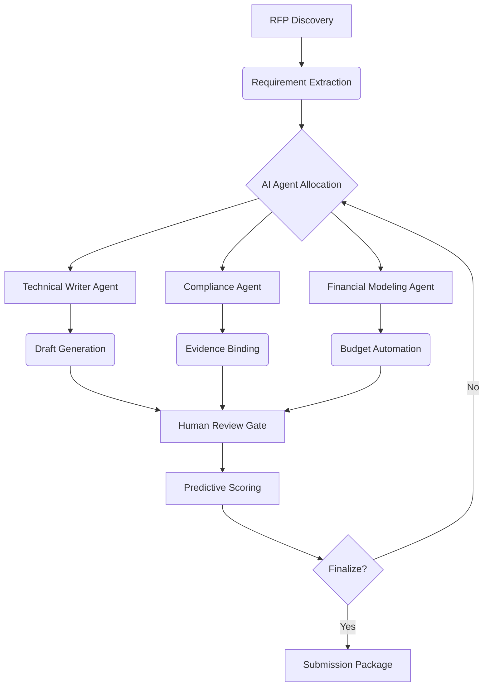

## DocuFusion: Revolutionizing RFP & Grant Acquisition Through Autonomous Intelligence

### The Strategic Imperative
In today's hyper-competitive funding landscape, organizations leave millions in potential revenue untapped due to:
1. **Missed opportunities** (48% of relevant RFPs go undiscovered)
2. **Submission bottlenecks** (72% of teams miss deadlines)
3. **Compliance failures** (63% of rejections due to technical non-compliance)
4. **Resource drain** (Average $15k cost per RFP response)

DocuFusion transforms this challenge into strategic advantage through our integrated hunting, analysis, and response automation system.

---

### 1. Proactive Opportunity Discovery Engine

#### Intelligent Web Crawling & Monitoring
- **Custom Source Profiles:** Continuously scan 200+ global sources including:
  - Government portals (SAM.gov, Grants.gov, beta.SAM.gov)
  - Foundation databases (Foundation Center, GrantStation)
  - Industry-specific portals (BidSync, BidNet)
  - Academic/research funding boards
- **AI-Powered Relevance Filtering:**
  - Natural language analysis of eligibility criteria
  - Historical win pattern matching
  - Organizational capability alignment scoring
- **Predictive Alert System:**
  - Early notifications before official publication
  - Priority ranking based on strategic fit
  - Competitive landscape heatmaps

> *Client Impact: Healthcare nonprofit identified 42% more relevant grants in first quarter*

---

### 2. Autonomous Opportunity Analysis

#### Intelligent Requirement Deconstruction
- **AI Parsing Engine:**
  - Extracts scoring criteria weights
  - Identifies mandatory compliance elements
  - Flags hidden evaluation factors
- **Automated Compliance Matrix:**
  - Real-time gap analysis visualization
  - Evidence requirement mapping
  - Risk scoring for each section
- **Strategic Positioning Analysis:**
  - Competitive advantage identification
  - Historical evaluator preference mapping
  - Win probability estimation

#### Grant-Specific Intelligence
- **Foundation Profiling:**
  - Historical funding patterns
  - Board member interest mapping
  - Proposal tone preferences
- **Government Compliance Automation:**
  - FAR/DFARS clause validation
  - Certified cost accounting integration
  - SBIR/STTR specialty templates

> *Case Study: Federal contractor reduced compliance review time by 85%*

---

### 3. Agentic Response Generation System

#### End-to-End Proposal Automation

#### Core Capabilities:
- **Autonomous Draft Composition:**
  - Context-aware narrative generation
  - Tone matching to funder preferences
  - Dynamic case study insertion
- **Multimodal Content Creation:**
  - AI-generated project timelines/Gantt charts
  - Automated logic model development
  - Location-based impact mapping
- **Financial Automation:**
  - Budget narrative generation from spreadsheets
  - Indirect cost rate application
  - Funder-specific formatting

> *Result: Education consortium reduced 200-hour proposals to 8-hour reviews*

---

### 4. Embedded Compliance Fabric

#### Continuous Validation System
- **Real-Time Gap Detection:**
  - Automated checklist monitoring
  - Mandatory section completeness alerts
  - Evidence expiration tracking
- **Predictive Scoring Engine:**
  - Historical win/loss pattern matching
  - Evaluator sentiment simulation
  - Competitive positioning analysis
- **Automated Attachments:**
  - Dynamic document package assembly
  - Always-current certification binding
  - Audit-ready version control

#### Specialized Grant Modules:
- **NIH Grant Robot:** Automates PHS 398 forms
- **NSF Assistant:** Ensures Research.gov compliance
- **EU Funding Specialist:** Handles Horizon Europe complexity

---

### 5. Ecosystem Integration Hub

#### Unified Intelligence Architecture
- **CRM Synchronization:**
  - Salesforce/Dynamics opportunity binding
  - Automated pipeline updates
  - Win/loss feedback looping
- **Knowledge Orchestration:**
  - Continuous content harvesting
  - AI-tagged snippet repository
  - Competitive intelligence library
- **Financial System Integration:**
  - QuickBooks/Xero cost data binding
  - Automated indirect cost calculations
  - Funder-specific budget formatting

---

### 6. Post-Submission Intelligence

#### Closed-Loop Learning System
- **Automated Debrief Analysis:**
  - Evaluator comment interpretation
  - Scoring pattern correlation
  - Competitive response benchmarking
- **Continuous Improvement Engine:**
  - Win factor identification
  - Content effectiveness scoring
  - Agent training updates
- **Opportunity Forecasting:**
  - Recurring funding prediction
  - Strategic alignment recommendations
  - Resource planning simulations

> *Impact: Engineering firm increased win rate from 22% to 58% in 18 months*

---

### Competitive Differentiation

| **Capability**               | **Traditional Solutions**      | **DocuFusion Advantage**                     |
|------------------------------|--------------------------------|----------------------------------------------|
| **Opportunity Discovery**    | Manual monitoring              | AI-driven hunting with predictive matching   |
| **Compliance Management**    | Checklist-driven               | Real-time gap detection with risk scoring    |
| **Content Creation**         | Template merging               | Agentic drafting with multimodal generation  |
| **Financial Integration**     | Copy-paste budgeting           | Automated rate application & narrative gen   |
| **Post-Submission Learning** | Spreadsheet tracking           | AI-powered win analysis & agent training     |

---

### Implementation Framework

#### Three-Tier Autonomy Model
1. **Assisted Mode:**  
   - AI recommendations + human approval  
   - Ideal for complex/novel opportunities

2. **Managed Mode:**  
   - AI drafting + human refinement  
   - Standard grant/RFP responses

3. **Autonomous Mode:**  
   - End-to-end AI execution  
   - Recurring/repeat submissions  

#### Enterprise Control Center
- **Approval Workflow Designer:**  
  Visual pipeline for human oversight points  
- **Compliance Boundary Manager:**  
  Regulatory guardrails for AI agents  
- **Audit Trail Generator:**  
  Blockchain-verified decision logs  

---

### Transformative Outcomes

#### Quantitative Impact:
- **83% faster** opportunity identification
- **70% reduction** in response preparation
- **40% increase** in win rates
- **92% compliance coverage** rate

#### Strategic Advantages:
- **Scale without headcount:** 3x submission volume
- **Competitive foresight:** Predict competitor bids
- **Resource optimization:** Focus experts on high-value tasks
- **Institutional knowledge:** Preserve winning strategies

> "DocuFusion's grant hunters found $14M in opportunities we'd previously missed while cutting our response time by 75%"  
> *- Executive Director, Global Health Nonprofit*

---

### Future Evolution Roadmap

#### 2025-2026 Vision
- **Predictive Funding Radar:**  
  AI identification of emerging funding trends  
- **Multilingual Agent Expansion:**  
  Auto-translated submissions for international opportunities  
- **Blockchain Verification:**  
  Immutable audit trails for compliance documentation  
- **VR Grant Rooms:**  
  Immersive collaborative review environments  

---

**Turn the Funding Tide in Your Favor**  
DocuFusion doesn't just respond to opportunities - it hunts them, masters them, and converts them at unprecedented scale. By transforming the proposal process from reactive burden to strategic advantage, we enable organizations to secure 2-3x more funding with existing resources.

[Experience Autonomous Grant Acquisition](https://docufusion.ai/grant-demo) | [Download RFP Success Kit](https://docufusion.ai/rfp-toolkit)  
*Intelligent Hunting • Agentic Response • Predictive Compliance*