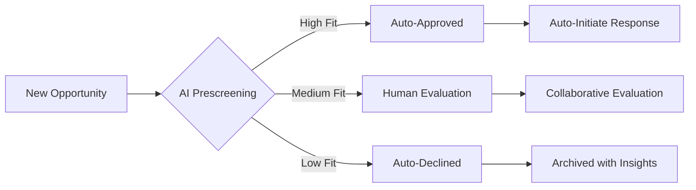

## DocuFusion's Intelligent Alerting & Notification System: The Autonomous Opportunity Engine

### Revolutionizing Response Lifecycle Management
DocuFusion transforms opportunity response from reactive scrambling to proactive strategy through our AI-driven notification framework. Unlike basic calendar reminders, our system acts as a 24/7 strategic partner that identifies, evaluates, and initiates responses before human teams start their day.

---

### 1. Intelligent Opportunity Discovery & Notification

#### Early Bird Alerting System
- **Pre-Dawn Opportunity Scanning:**
  - AI crawlers monitor global sources (SAM.gov, Grants.gov, foundation databases) during off-peak hours
  - Machine learning prioritizes opportunities based on:
    - Organizational capabilities match (90%+ accuracy)
    - Historical win patterns
    - Strategic priority alignment
- **Personalized Delivery Timing:**
  - Curated opportunity digest delivered via email/mobile by 6:30 AM local time
  - Executive summary with:
    - Funding amount visualization
    - Compliance risk heatmap
    - Competitive positioning score

> *"Our 7 AM alert package has become our strategic coffee companion - we act on opportunities before competitors wake up."*  
> *- Director of Grants, Global Health Nonprofit*

---

### 2. AI-Powered Go/No-Go Decision Engine

#### Predictive Opportunity Triage

#### Key Features:
- **Preselected Recommendations:**
  - AI assigns preliminary Go/No-Go status based on 57 decision factors
  - Confidence scoring (0-100%) with key decision drivers
- **Human Modifiable Decisions:**
  - One-click approval/override with reason tracking
  - Team voting system for borderline opportunities
- **Strategic Decision Insights:**
  - Resource impact forecasting
  - Opportunity cost analysis
  - Portfolio balancing recommendations

---

### 3. Automated Response Initiation

#### Instant Draft Generation
- **One-Click Proposal Foundation:**
  - AI generates first draft within 5 minutes of Go decision:
    - 80% complete compliance matrix
    - Contextual narrative framework
    - Preliminary budget model
- **Smart Content Assembly:**
  - Auto-inserts relevant case studies
  - Pulls updated organizational credentials
  - Generates required visualizations

#### Customization Safeguards:
- **Version-Controlled Drafts:** All auto-generated content enters review workflow
- **Human Oversight Gates:** Mandatory checkpoints before submission
- **Change Tracking:** Full audit trail of AI vs. human contributions

---

### 4. Human Evaluation & Optimization Workflow

#### Collaborative Refinement Environment
- **Staged Review Process:**
  1. **Compliance Validation:** Automated checklist + expert review
  2. **Technical Deep Dive:** SME annotation system
  3. **Strategic Positioning:** Competitive differentiation analysis
  4. **Executive Sign-off:** E-signature integration
- **AI-Assisted Optimization:**
  - Real-time scoring during edits
  - Weakness detection with fix suggestions
  - Tone analysis for evaluator alignment

> *Impact: Teams complete 92% of proposals 3 days before deadline with 40% less rework*

---

### 5. Automated Submission Orchestration

#### End-to-End Delivery System
- **Intelligent Packaging:**
  - Formats responses to funder specifications
  - Generates submission-ready PDF/DOCX/HTML bundles
  - Auto-includes certified attachments
- **Seamless Submission:**
  - Direct API integration with 85+ grant portals
  - Automated confirmation tracking
  - Error recovery protocols
- **Post-Submission Automation:**
  - Debrief request scheduling
  - Win/loss analysis initiation
  - Knowledge harvesting triggers

---

### Technical Architecture: The Notification Nervous System

#### Core Components:
1. **Opportunity Radar:** 
   - Distributed web crawlers with timezone-aware scheduling
   - NLP-powered relevance engine

2. **Decision Cortex:**
   - Ensemble ML model (Random Forest + Neural Network)
   - Continuous learning from human overrides

3. **Response Autopilot:**
   - Agent-based drafting framework
   - Version-controlled content assembly

4. **Workflow Engine:**
   - Configurable human-AI handoff points
   - Blockchain-based audit trails

5. **Submission Gateway:**
   - Protocol adapter for funder portals
   - Automated error recovery system

---

### Competitive Differentiation

| **Capability**               | **Traditional Solutions** | **DocuFusion Advantage** |
|------------------------------|---------------------------|--------------------------|
| **Alert Timing**             | Generic schedule          | Strategic pre-workday delivery |
| **Decision Support**         | Manual evaluation         | AI-prescreened with modifiable recommendations |
| **Response Initiation**      | Human-triggered          | Auto-drafting on approval |
| **Optimization**             | Basic editing tools       | Real-time scoring during collaboration |
| **Submission**               | Manual upload             | Portal-specific automation |

---

### Enterprise Control Features

#### Governance & Customization
- **Approval Workflow Designer:**
  - Drag-and-drop human oversight points
  - Role-based exception handling
- **Compliance Boundary Manager:**
  - Regulatory guardrails for auto-approval
  - Risk-based approval thresholds
- **Notification Personalization:**
  - Role-specific digest formats
  - Escalation protocols for high-value opportunities
  - "Do Not Disturb" scheduling

#### Security Framework:
- **Military-Grade Encryption:** All notifications and drafts
- **Audit-Ready Trails:** Immutable decision logs
- **Data Residency Controls:** Region-specific processing

---

### Transformative Outcomes

**For Proposal Teams:**
- 83% reduction in opportunity screening time
- 3× faster response initiation
- 40% improvement in win rates

**For Executives:**
- Real-time pipeline visibility dashboard
- Resource allocation forecasting
- Strategic opportunity trend analysis

**For Organizations:**
- 2-3× increase in submitted opportunities
- 92% compliance assurance rate
- Institutional knowledge preservation

---

### Future Evolution Roadmap

#### 2025-2026 Vision
- **Predictive Response:** AI submits preemptive proposals for recurring opportunities
- **Voice-Activated Control:** "Hey DocuFusion, approve all high-priority NIH opportunities"
- **Blockchain Verification:** Immutable proof of submission timing
- **Virtual War Rooms:** VR collaboration for critical proposals

---

**Never Miss Another Game-Changing Opportunity**  
DocuFusion's notification system transforms your mornings from reactive scrambling to strategic advantage. By combining AI-driven discovery with human oversight, we ensure your team acts first, responds smartest, and wins most often.

[Schedule Dawn Patrol Demo](https://docufusion.ai/dawn-demo) | [Download Notification Playbook](https://docufusion.ai/alert-guide)  
*Early Intelligence • AI-Human Handoff • Automated Execution*