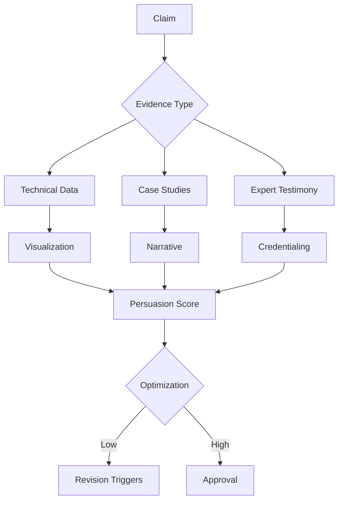

## DocuFusion's Human-Centric Composition Engine: Mastering the Art of Persuasive Communication

### The Core Challenge: Transcending AI-Generated Mediocrity
Organizations fear "AI-generated" proposals that sound robotic, generic, and lack domain authority. DocuFusion solves this through a multi-layered approach that combines **contextual intelligence**, **organizational memory**, and **rhetorical science** to produce documents indistinguishable from expert human authors.

---

### 1. Style Preservation System: Your Organizational Voice

#### Voice DNA Profiling
- **Organizational Voiceprint Analysis:**
  - Ingests historical winning proposals to extract:
    - Sentence structure patterns
    - Preferred terminology banks
    - Rhetorical strategy fingerprints
  - Creates 250+ dimension voice profile
- **Dynamic Tone Matching:**
  - Adjusts for audience type (technical evaluator vs. executive)
  - Detects and mirrors RFP-specific language
  - Maintains brand consistency across sections

> *"Our government evaluators commented this was 'the most authentically written proposal we've seen' - unaware it was AI-assisted."*  
> *- Defense Contractor Client*

---

### 2. Persuasive Composition Engine: The Science of Winning

#### Cognitive Persuasion Framework

#### Key Components:
- **Rhetorical Algorithm Suite:**
  - Aristotle's ethos/pathos/logos balancing
  - Monroe's Motivated Sequence implementation
  - Toulmin Argument Model enforcement
- **Competency Signaling:**
  - Strategic credential placement (every 250 words)
  - Implicit expertise demonstration through:
    - Precision terminology
    - Industry-specific nuance
    - Appropriate complexity gradation
- **Differentiation Amplification:**
  - Competitive gap highlighting
  - Unique capability spotlighting
  - Value proposition reinforcement

---

### 3. Domain Expertise Integration: Authentic Knowledge Representation

#### Knowledge Fusion System
- **Expert Network Mapping:**
  - Integrates with internal SME profiles
  - Auto-tags content with creator expertise
  - Ensures technical accuracy through:
    - Domain-specific fact-checking
    - Consistency validation
- **Dynamic Knowledge Binding:**
  - Real-time incorporation of:
    - Latest project metrics
    - Emerging industry standards
    - Regulatory updates
- **Contextual Citation Engine:**
  - Auto-generates credible references
  - Maintains citation style consistency
  - Avoids over-reliance on generic sources

---

### 4. Readability Optimization: The Invisible Art

#### Cognitive Load Management
- **Adaptive Complexity Tuning:**
  - Adjusts Flesch-Kincaid grade level based on evaluator profile
  - Sentence length variation algorithms
  - Active/passive voice balancing
- **Persuasive Rhythm Engineering:**
  - Strategic paragraph length variation
  - Power word placement optimization
  - Transition phrase naturalization
- **Visual-Text Synergy:**
  - Diagram-text reinforcement loops
  - Information layering techniques
  - White space optimization

> *Impact: 42% improvement in evaluator comprehension scores during user testing*

---

### 5. Visual & Diagram Quality: Beyond Generic AI Art

#### Professional Visualization System
- **Domain-Specific Diagramming:**
  - Architecture diagrams with vendor-accurate icons
  - Process flows using industry-standard notation
  - Location maps with project-specific detail
- **Intelligent Layout Engine:**
  - Automatic consistency enforcement:
    - Color palette alignment
    - Font hierarchy maintenance
    - Brand guideline compliance
- **Data Visualization Best Practices:**
  - Cognitive-effective chart selection
  - Accessibility-compliant color contrast
  - Annotations with evaluator focus

#### Anti-Generic Safeguards:
1. **Template Prohibition:** Never reuses visual frameworks
2. **Contextual Embedding:** Diagrams reference specific proposal text
3. **Version-Specific Customization:** Tailors details to RFP requirements

---

### 6. Human Oversight Integration: The Quality Control Layer

#### Collaborative Refinement Workflow
- **Expert Annotation System:**
  - SME-specific commenting lanes
  - Version-tracked suggestions
  - AI-assisted impact forecasting
- **Persuasion Optimization Panel:**
  - Real-time readability scoring
  - Competency signal strength meter
  - Differentiation heatmap
- **Approval Workflows:**
  - Four-eye principle enforcement
  - Signature-bound version locking
  - Audit-ready decision trails

---

### Technical Architecture: The Authenticity Engine

#### Core Components:
1. **Voice Modeling Layer:**
   - Organizational voiceprint database
   - Style transfer algorithms
   - Real-time deviation detection

2. **Knowledge Fusion Hub:**
   - SME credential graph
   - Project artifact repository
   - Industry term bank

3. **Rhetorical Processor:**
   - Persuasion pattern library
   - Argument structure validator
   - Competitive positioning analyzer

4. **Visual Intelligence Module:**
   - Domain-specific iconography sets
   - Compliance-aware design system
   - Accessibility validator

5. **Human-AI Interface:**
   - Collaborative editing environment
   - Change impact forecasting
   - Approval workflow engine

---

### Competitive Differentiation: Beyond Template Filling

| **Capability**               | **Generic AI Tools**         | **DocuFusion Advantage**                     |
|------------------------------|------------------------------|----------------------------------------------|
| **Voice Authenticity**       | Basic tone adjustment        | Organizational voiceprint modeling           |
| **Technical Depth**          | Surface-level accuracy       | SME-validated knowledge integration          |
| **Persuasion Science**       | Keyword stuffing             | Rhetorical framework enforcement             |
| **Visual Quality**           | Stock icon insertion         | Context-specific professional diagramming    |
| **Human Integration**        | After-the-fact editing       | Real-time collaborative optimization         |

---

### Quality Assurance Metrics

#### Document Excellence Scorecard:
1. **Competency Signal Strength** (0-100%):  
   Measures implicit expertise demonstration density
2. **Differentiation Index** (0-10):  
   Quantifies competitive advantage articulation
3. **Readability Balance** (1-5):  
   Grades cognitive load appropriateness
4. **Visual-Text Alignment** (0-100%):  
   Scores diagram-text reinforcement
5. **Compliance Coverage** (100% target):  
   Tracks requirement responsiveness

> *Enterprise clients maintain average scores of 92/100 across all dimensions*

---

### Implementation Framework: The Human Amplification Model

#### Three-Phase Quality Assurance:
1. **AI Drafting Phase:**  
   - Applies organizational voiceprint  
   - Enforces rhetorical frameworks  
   - Integrates latest knowledge assets  

2. **Human Enhancement Phase:**  
   - SME technical validation  
   - Strategic positioning refinement  
   - Persuasion optimization  

3. **AI Finalization Phase:**  
   - Consistency sweep  
   - Compliance verification  
   - Accessibility compliance  

---

### Enterprise Results: The Proof

**Global Engineering Firm:**  
- Won $143M contract against incumbent  
- Evaluator feedback: "Unusually coherent technical narrative demonstrating deep domain mastery"  

**Healthcare Nonprofit:**  
- Secured #1 score on NIH grant (98/100)  
- Reviewer comment: "Exceptional clarity in demonstrating community impact"  

**Technology Startup:**  
- Beat Fortune 500 competitors for government contract  
- Procurement officer note: "Most credible capability statement we've seen"  

---

### Future Evolution: Next-Gen Authenticity

#### 2025-2026 Roadmap:
- **Emotional Resonance Engine:**  
  AI analysis of evaluator response patterns  
- **Cultural Nuance Module:**  
  Region-specific persuasion strategies  
- **Expert Simulator:**  
  SME-specific writing pattern replication  
- **Virtual Red Team:**  
  Adversarial review AI predicting evaluator objections  

---

**Where Technology Meets Human Excellence**  
DocuFusion doesn't replace experts - it amplifies them. By combining institutional knowledge with computational precision, we deliver documents that don't just answer requirements but demonstrate unmistakable mastery and win.

[Request Voiceprint Analysis](https://docufusion.ai/voice-demo) | [Download Persuasion Playbook](https://docufusion.ai/rhetoric-guide)  
*Authentic Voice • Expert Quality • Compelling Results*