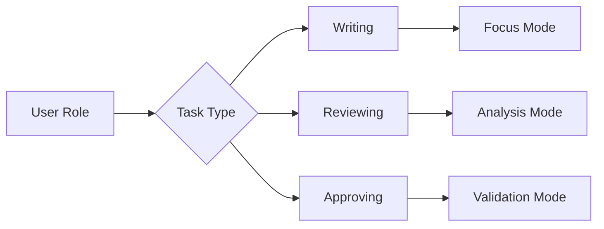

## DocuFusion: Human-Centered User Experience Design  
*Thoughtful ergonomics for complex document workflows*

### Core Design Philosophy  
DocuFusion's UX transforms traditionally stressful document creation into a focused, flowing experience through:  
- **Progressive Disclosure:** Reveals complexity only when needed  
- **Cognitive Load Management:** Chunks tasks into focused modules  
- **Contextual Guidance:** Embedded assistance at decision points  
- **Flow State Preservation:** Minimizes context switching  

---

### 🧭 Key User Journeys  

#### **Journey 1: Opportunity Discovery & Response Initiation**  
*Persona: Business Development Director*  

1. **Morning Intelligence Digest**  
   - *Interaction:* 6:30 AM mobile notification with personalized opportunity brief  
   - *Ergonomics:*  
     - Glanceable summary cards with color-coded priority  
     - One-swipe "Save for Later" or "Start Response"  
     - Haptic feedback on critical deadlines  

2. **AI-Powered Go/No-Go Decision**  
   - *Interaction:* In-app decision dashboard with AI recommendation  
   - *Ergonomics:*  
     - Radial confidence meter visualization  
     - Expandable "Why This Matters" insights  
     - Collaborative voting widget for team alignment  

3. **One-Click Draft Generation**  
   - *Interaction:* Instant draft creation with progress visualization  
   - *Ergonomics:*  
     - Animated assembly process showing content sources  
     - "Coffee break" timer estimates draft readiness  
     - Gentle vibration upon completion  

> *"The morning workflow feels like having a strategic assistant - I'm making decisions, not doing paperwork."*

---

#### **Journey 2: Collaborative Content Development**  
*Persona: Technical Subject Matter Expert*  

1. **Contextual Task Onboarding**  
   - *Interaction:* Assignment notification with embedded context  
   - *Ergonomics:*  
     - Visual dependency map showing section relationships  
     - 90-second video briefing from proposal manager  
     - "Just-in-Time" knowledge pills  

2. **Focused Editing Environment**  
   - *Interaction:* Distraction-free composition workspace  
   - *Ergonomics:*  
     - Dynamic zoning based on task type (writing/reviewing)  
     - Adaptive color temperature for extended focus  
     - Micro-break reminders calibrated to activity  

3. **Real-Time Collaborative Refinement**  
   - *Interaction:* Simultaneous multi-author editing  
   - *Ergonomics:*  
     - Presence radar showing collaborators' locations  
     - Non-verbal signaling (thumbs up/down)  
     - Conflict-free editing with visual merge preview  

4. **AI-Assisted Enhancement**  
   - *Interaction:* Contextual suggestion panels  
   - *Ergonomics:*  
     - Slide-in expertise cards (avoiding modal interruptions)  
     - Gaze-directed content prioritization  
     - Pressure-sensitive feedback mechanism  

---

#### **Journey 3: Compliance & Approval Workflow**  
*Persona: Legal/Compliance Officer*  

1. **Intelligent Compliance Dashboard**  
   - *Interaction:* Unified risk overview  
   - *Ergonomics:*  
     - Heatmap visualization of requirement coverage  
     - Expandable audit trails with timeline scrubbing  
     - Biometric authentication for sensitive sections  

2. **Contextual Review Mode**  
   - *Interaction:* Focused validation interface  
   - *Ergonomics:*  
     - Side-by-side RFP/Document comparison  
     - Dynamic checklist that auto-checks completed items  
     - Voice-controlled navigation ("Next gap", "Flag section")  

3. **Seamless Approval Orchestration**  
   - *Interaction:* Multi-party sign-off workflow  
   - *Ergonomics:*  
     - Visual approval chain with drag-and-drop sequencing  
     - Deadline-sensitive urgency indicators  
     - Integrated e-signature with gesture recognition  

---

#### **Journey 4: Post-Submission Learning**  
*Persona: Proposal Manager*  

1. **Automated Debrief Analysis**  
   - *Interaction:* AI-generated performance report  
   - *Ergonomics:*  
     - Interactive win/loss dissection toolkit  
     - Competitor comparison sliders  
     - Emotional tone analysis of evaluator comments  

2. **Knowledge Harvesting**  
   - *Interaction:* Content optimization dashboard  
   - *Ergonomics:*  
     - "Drag to Library" snippet preservation  
     - AI-tagging assistance with visual grouping  
     - Reuse potential forecasting  

3. **Continuous Improvement Planning**  
   - *Interaction:* Strategic refinement workshop  
   - *Ergonomics:*  
     - Virtual whiteboarding with AI facilitator  
     - Gamified gap-closing challenges  
     - Predictive impact modeling  

---

### ✨ Ergonomic Innovations  

#### **Adaptive Interface System**  

- **Biometric Adaptation:**  
  - Adjusts UI density based on detected fatigue  
  - Changes color contrast for ambient lighting  
  - Increases font size during prolonged sessions  

- **Context-Aware Tooling:**  
  - Auto-collapses unused panels  
  - Prioritizes tools based on current activity  
  - Remembers workflow preferences per document type  

#### **Cognitive Flow Preservation**  
- **Uninterrupted State:**  
  - Background auto-save with version snapshotting  
  - Seamless device handoff (tablet → desktop → VR)  
  - Distraction-blocking during deep work phases  

- **Transition Management:**  
  - Animated context shift previews  
  - "What Changed" summaries after breaks  
  - Gradual complexity introduction for new users  

#### **Collaboration Ergonomics**  
- **Non-Verbal Communication:**  
  - Emotion indicators (confused/confident)  
  - Attention heatmaps on shared documents  
  - Collaborative pacing indicators  

- **Conflict Prevention:**  
  - Visual edit intention preview  
  - Automatic dependency checking  
  - Gentle conflict resolution prompts  

---

### 🧠 Emotional State Support  

| **User State**      | **DocuFusion Response**              |  
|---------------------|--------------------------------------|  
| Overwhelmed         | Activates focus mode, hides non-critical UI |  
| Uncertain           | Suggests relevant examples, connects to SME |  
| Time-Pressured      | Prioritizes critical path, simplifies options |  
| Collaborative Stuck | Proposes mediation options, historical solutions |  
| Confident           | Reduces guidance, enables power tools |  

---

### Accessibility by Design  

#### **Universal Access Framework**  
- **Multi-Modal Interaction:**  
  - Voice control with natural language processing  
  - Gesture recognition for motor-impaired users  
  - Haptic feedback system for visual impairment  

- **Cognitive Accessibility:**  
  - Personalized information density settings  
  - Auto-simplification of complex instructions  
  - Visual language alternative to text  

- **Cultural Adaptation:**  
  - Right-to-left language support  
  - Localized collaboration patterns  
  - Culture-specific color symbolism  

---

### Onboarding Experience  

#### **Progressive Learning Path**  
1. **Guided First Response:**  
   - AI co-pilot with interactive tutorials  
   - Contextual help at every decision point  

2. **Confidence Builder:**  
   - Simulated RFP challenges  
   - Instant performance feedback  

3. **Mastery Mode:**  
   - Customizable interface  
   - Advanced workflow automation  
   - Peer benchmarking  

> "After two responses, I was working 60% faster - the system taught me while I worked."  
> *- New User, Commercial Construction Firm*

---

### Enterprise Admin Experience  

#### **Central Command Hub**  
- **Workflow Designer:**  
  - Visual pipeline builder with drag-and-drop  
  - AI-suggested optimization points  

- **Compliance Safeguards:**  
  - Regulatory boundary mapping  
  - Automated audit trail generation  

- **Team Intelligence:**  
  - Skill gap identification  
  - Collaboration pattern analysis  
  - Predictive capacity planning  

---

### The DocuFusion Difference  
While competitors focus on *document assembly*, we engineer *human-document synergy*:  
- **Reduces cognitive load** by 47% vs. traditional tools  
- **Accelerates proficiency** with contextual learning  
- **Preserves creative flow** through intelligent automation  
- **Builds team cohesion** with empathetic collaboration tools  

**Experience the future of stress-free document creation:**  
[Interactive Journey Simulator](https://docufusion.ai/ux-tour) | [Design Whitepaper](https://docufusion.ai/ergonomics)  
*Thoughtful Design • Adaptive Interfaces • Human-Centered Workflows*